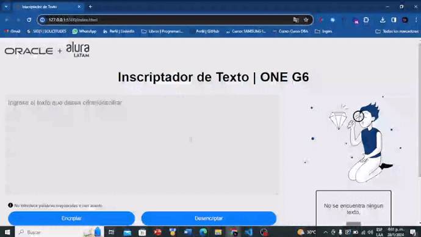
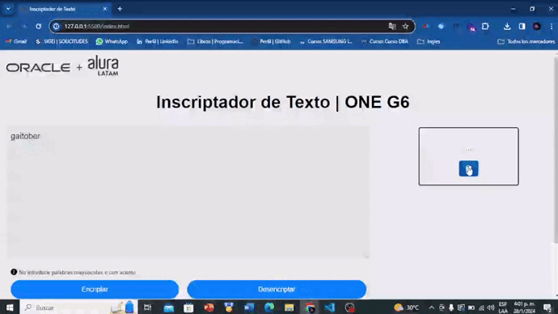

<h1 align="center">INSCRIPTADOR DE TEXTO</h1>

## Tabla de contenidos:
- [Descripción y contexto](#descripción-y-contexto)
- [Guía de usuario](#guía-de-usuario)
- [Información adicional](#información-adicional)
- [Autor/es](#autores)

## Descripción y contexto
Oracle Next Education (ONE), en colaboración con Alura Latam, presenta el desafío "Encriptador de Texto". Este desafío invita a los participantes a explorar el poder de JavaScript para crear un inscriptor de texto único. Imagina un mundo donde cada palabra se transforma en una experiencia visual y sonora única. Los participantes deberán demostrar su creatividad y destreza técnica para diseñar un inscriptor innovador que lleve la programación a nuevas alturas.

## Guía de usuario
### Encriptación:

### Copiar y Pegar:

### Desencriptado:

## Información adicional
**Comunidad y Soporte:** Únete a la comunidad ONE en línea para discutir ideas, compartir conocimientos y obtener soporte adicional.

## Autor/es
 [Braily_rs35](https://www.instagram.com/braily_rs35/ "Braily_rs35")

 brailyrs03@gmail.com
